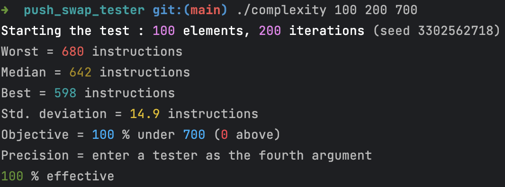
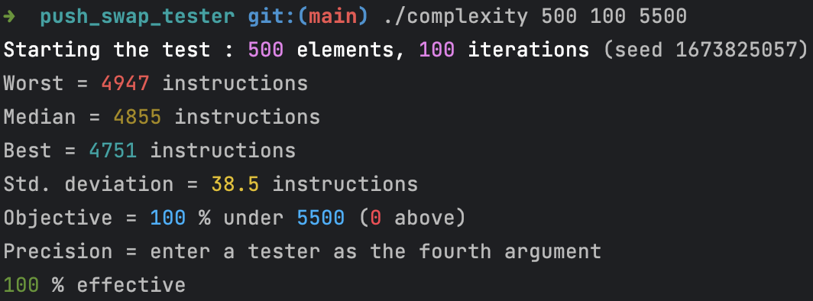

# Push_Swap Project

The goal of this project is to create a program that sorts a stack of integers using two stacks and a limited set of instructions.

## Installation

To run this project, simply clone the repository and compile the program:

```shell
git clone https://github.com/tdameros/42-push_swap
cd 42-push_swap/
make
make bonus
```

This will create two executables called `push_swap` and `checker`.

## Usage

The `push_swap` program takes a list of integers as arguments and outputs a series of instructions that will sort the stack. For example:

```shell
./push_swap 3 1 4 2
```

This will output a list of instructions that will sort the stack `[3, 1, 4, 2]`.

The `checker` program takes a list of integers as arguments and reads a series of instructions from standard input. It then applies these instructions to the stack and checks if the stack is sorted. For example:

```shell
./checker 3 1 4 2
sa
pb
ra
pb
rra
pa
pa
```

This will apply the instructions to the stack `[3, 1, 4, 2]` and output either `OK` if the stack is sorted or `KO` otherwise.

_Don't forget to use CTRL+D to indicate the end of the instructions in the checker._

## Instructions

The following instructions are available:

- `sa`: swap the first two elements on stack A
- `sb`: swap the first two elements on stack B
- `ss`: `sa` and `sb` at the same time
- `pa`: pop the top element from stack B and push it onto stack A
- `pb`: pop the top element from stack A and push it onto stack B
- `ra`: rotate the stack A (move the top element to the bottom)
- `rb`: rotate the stack B (move the top element to the bottom)
- `rr`: `ra` and `rb` at the same time
- `rra`: reverse rotate the stack A (move the bottom element to the top)
- `rrb`: reverse rotate the stack B (move the bottom element to the top)
- `rrr`: `rra` and `rrb` at the same time

## Strategy

The goal is to sort the stack using as few instructions as possible. To do this, you need to come up with a strategy that takes advantage of the limited set of instructions.

1. Pre-sort numbers in order to index them
2. Divide into 3 parts, the largest tier stays on stack A, the smallest tier is at the bottom of stack B and the middle tier is on top of stack B
3. Use quicksort on all 3 parts. Recursively the smaller half is sent to the B stack and then the larger half is sent to the A stack
4. Optimize the instructions, for example if the instructions RA and RB follow each other, then replace by RR

## Examples
Visualizer for debugging : [https://github.com/o-reo/push_swap_visualizer](https://github.com/o-reo/push_swap_visualizer)

Tester : [https://github.com/SimonCROS/push_swap_tester](https://github.com/SimonCROS/push_swap_tester)




